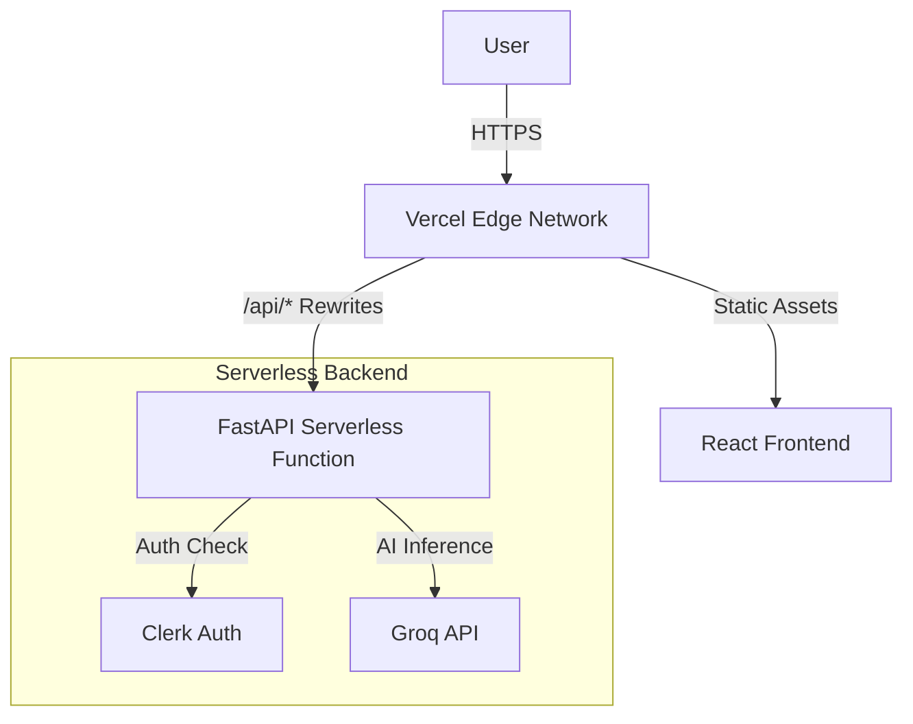

# 🧠 StudyBuddy - AI-Powered Learning Assistant


**StudyBuddy** is a comprehensive AI-powered educational platform designed to enhance the learning experience. By leveraging the power of **Groq's LLaMA 3** models, it offers topic simplification, content summarization, quiz generation, flashcard creation, and a built-in Pomodoro timer—all wrapped in a modern, responsive **Violet-themed** interface.

---

## ✨ Key Features

- **⏱️ Pomodoro Timer**: Stay focused with the built-in Pomodoro technique timer (25-min work, 5-min break).
- **📚 Topic Simplifier**: Break down complex subjects into easy-to-understand explanations.
- **📝 PDF & Text Summarizer**: Instantly extract key insights from documents and long texts.
- **🎯 Smart Quiz Generator**: Create custom quizzes on any topic to test your knowledge.
- **🗂️ Flashcard Creator**: Automatically generate meaningful flashcards for active recall study.
- **🔐 Secure Authentication**: Integrated with **Clerk** for robust user management.

---

## 🛠️ Technology Stack

### Frontend
- **Framework**: [React 19](https://react.dev/) + [Vite](https://vitejs.dev/)
- **Deployment**: Vercel (Static Site)
- **Styling**: [Tailwind CSS v4](https://tailwindcss.com/) (Violet/Purple Theme)
- **UI Components**: [Lucide React](https://lucide.dev/), [Framer Motion](https://www.framer.com/motion/)
- **State/Auth**: [Clerk](https://clerk.com/), Context API
- **HTTP Client**: Axios

### Backend
- **Framework**: [FastAPI](https://fastapi.tiangolo.com/) (Python 3.8+)
- **Deployment**: Vercel Serverless Functions (`api/` directory)
- **AI Engine**: [Groq API](https://groq.com/) (LLaMA 3.3 70B)
- **Validation**: Pydantic v2

---

## 🏗️ Architecture



---

## 🚀 Getting Started

Follow these steps to set up the project locally.

### Prerequisites
- **Node.js** (v18+) & **npm**
- **Python** (v3.10+)
- **Groq Cloud** API Key
- **Clerk** Account (Publishable Key & Issuer URL)

### 1. Backend Setup

1.  **Clone the repository**:
    ```bash
    git clone https://github.com/dev-Amann/AI-StudyBuddy.git
    cd StudyBuddy
    ```

2.  **Navigate to the backend directory**:
    ```bash
    cd backend
    ```

3.  **Create and activate a virtual environment**:
    ```bash
    python -m venv venv
    
    # Windows
    .\venv\Scripts\activate
    
    # macOS/Linux
    source venv/bin/activate
    ```

4.  **Install dependencies**:
    ```bash
    pip install -r requirements.txt
    ```

5.  **Configure Environment Variables**:
    Create a `.env` file in the `backend/` directory:
    ```env
    GROQ_API_KEY=gsk_...
    CLERK_ISSUER_URL=https://<your-clerk-domain>.clerk.accounts.dev
    ```

6.  **Run the Server**:
    ```bash
    uvicorn app.main:app --reload
    ```
    *The backend will start at `http://127.0.0.1:8000`.*

### 2. Frontend Setup

1.  **Open a new terminal and navigate to the frontend**:
    ```bash
    cd frontend
    ```

2.  **Install npm dependencies**:
    ```bash
    npm install
    ```

3.  **Configure Environment Variables**:
    Create a `.env.local` file in the `frontend/` directory:
    ```env
    VITE_CLERK_PUBLISHABLE_KEY=pk_test_...
    VITE_API_URL=/api
    ```

4.  **Start the Development Server**:
    ```bash
    npm run dev
    ```
    *The app will launch at `http://localhost:5173`.*

---

## ☁️ Deployment (Vercel)

This project is configured for **Zero-Config Vercel Deployment**.

1.  Push your code to GitHub.
2.  Import the project in Vercel.
3.  **Environment Variables**: Add your backend environment variables (`GROQ_API_KEY`, `CLERK_ISSUER_URL`) to the Vercel project settings.
4.  Deploy! 
    - Vercel automatically detects the `api` folder and deploys it as a Python Serverless Function.
    - `vercel.json` handles the build command and API routing.

---

## 📖 Usage Guide

1.  **Sign Up/Login**: Create an account using the Clerk-powered authentication page.
2.  **Dashboard**: Access the main hub to navigate between tools.
3.  **Pomodoro Timer**: Use the timer to manage your study sessions with focus and break intervals.
4.  **Generators**: Use the "Quiz" or "Flashcards" tools to generate study materials from raw text or topics.

---

## 🤝 Contributing

Contributions are welcome! Please fork the repository and submit a pull request for any enhancements or bug fixes.

---

## 📄 License

Distributed under the MIT License. See `LICENSE` for more information.

